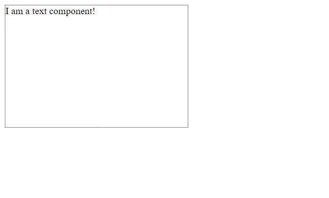

# Frontend-JS-Framework
Attempt at making a front-end JS framework inspired by React and Vue

## Project Setup

```
npm install
```

## Run local server

```
npm run serve
```

## Example

A component that updates its text and changes its size when clicked:

```javascript
import { div, text } from 'Framework'

export default div()
    .class('example')                   // add as many attributes as you want
    .localState({                       // store the local state of the component
        text: 'I am a text component!',
        dimensions: [200, 300]
    })
    .style(function() {                 // change style dynamically from local state
        return `
            height: ${this.localState.dimensions[0]}px;
            width: ${this.localState.dimensions[1]}px;
            transition: 1s;
        `
    })
    .event.click(function() {           // add event listeners
        this.localState.text = 'I was clicked!'
        this.localState.dimensions = [300, 500]
    })
    .children(function() { return [     // add children
        text(this.localState.text)
    ]})
```



## Tutorial
Follow the full [tutorial](https://github.com/felixxwu/Frontend-JS-Framework/blob/master/tutorial/README.md) to get started.
