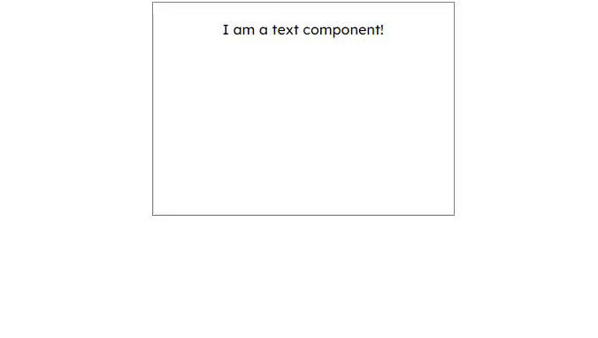
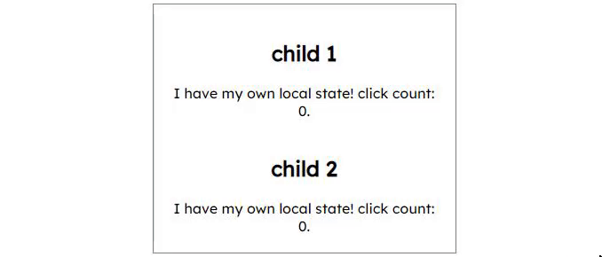
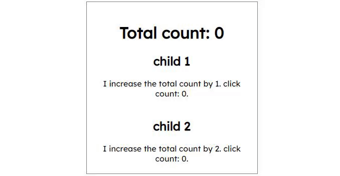

# Tutorial
Here are some examples to show how this framework can be used

## Setup
To start a local development server, run `npm run start` or `parcel index.html` in a console window.

`/index.html`:
```html
<!DOCTYPE html>
<html lang="en">
<head>
    <link rel="stylesheet" href="style.css">
    <title>Tutorial</title>
</head>
<body>
    <div id="app"></div>
    <script src="index.js"></script>
</body>
</html>
```

`/index.js`:

```javascript
import { Renderer } from 'Framework'

import Example from './components/Example'
Renderer.render(Example, 'app')
```

`/components/Example.js`:

```javascript
import { div } from 'Framework'

export default div() // just an empty div element
```

## Attributes

HTML tags such as `div`, `button`, `h1` etc. can be imported from the Framework. HTML attributes can be added to the component using `.<attribute>(<value>)`, and can be chained together in any order.

During rendering, the HTML elements are created using `document.createElement(tag)`, and the attributes are added using `element.setAttribute(attribute, value)`.

A component that represents a div element with a class attribute.
`/components/Example.js`:

```javascript
import { div } from 'Framework'

export default div().class('example').style('padding: 10px') // attributes can be chained in any order
```

`/style.css`:

```css
.example {
    width: 300px;
    min-height: 200px;
    border: 1px grey solid;
}
```


## Children

Every component can have other components as children, which can be done by passing an array (or a function that returns an array) into `.children()`.

`text` is a special component that represents simple plaintext, during rendering it is created using `document.createTextNode(text)`.

A component with a text element child.
`/components/Example.js`:

```javascript
import { div, text } from 'Framework'

export default div()
    .class('example')
    .children([ // array of components
        text('I am a text component!')
    ])
```


## Local State

Every component can store some state about itself using `.localState()`, and can be accessed with `this.localState` in a function.

Note that if you want to access `this`, you will need to pass a function that returns the value rather than the value directly (must not be an arrow function `() => {}`). This way, the renderer can correctly bind the right context when evaluating an argument.

During rendering, events are added using `element.addEventListener(eventName, handler)`. The `handler` is bound with the component object so that `this` can be accessed in the handler ( `handler.bind(component)` ).

A component that updates its text when clicked.
`/components/Example.js`:

```javascript
import { div, text } from 'Framework'

export default div()
    .class('example')
    .localState({
        text: 'I am a text component!'
    })
    .event.click(function() { // if you want to access "this", do not use an arrow function () => {}.
        this.localState.text = 'I was clicked!'
    })
    .children(function() { return [ // if you want to access "this", you will need to pass in a function that returns the children.
        text(this.localState.text)
    ]})
```


## CSS Transitions

Passing in a function to `.style()` allows you to access `this`, allowing you to modify the inline style depending on the local state. Adding `transition` to the inline style allows for smooth transitions.

A component that updates its text and changes its size when clicked.
`/components/Example.js`:

```javascript
import { div, text } from 'Framework'

export default div()
    .class('example')
    .localState({ // added a new local state "dimensions"
        text: 'I am a text component!',
        dimensions: [200, 300]
    })
    .style(function() { // inline style attribute to change the height and width of the component
        return `
            height: ${this.localState.dimensions[0]}px;
            width: ${this.localState.dimensions[1]}px;
            transition: 1s;
        `
    })
    .event.click(function() {
        this.localState.text = 'I was clicked!'
        this.localState.dimensions = [300, 500] // update the local state with new dimensions
    })
    .children(function() { return [ // same as previous example
        text(this.localState.text)
    ]})
```



## Props

The easiest way to give a component props to use is by wrapping it in a function call.

A component with two children, each given a different prop.
`/components/Example.js`:

```javascript
import { div, br } from 'Framework'
import ExampleChild from './ExampleChild'

export default div()
    .class('example')
    .children([
        ExampleChild(1),
        br(),
        ExampleChild(2),
    ])
```

`/components/ExampleChild.js`:

```javascript
import { text, div, h1 } from 'Framework'

export default (number) => { // entire component wrapped in a function call
    return div()
        .children([ // no need to pass function if there are no uses of "this"
            h1().children([
                text('child ' + number)
            ]),
            text(`I am a child component with prop: ${number}`)
        ])
}
```


## Local State Example 2
A component with two children, each with local states for counting number of clicks individually.
`/components/Example.js`:

```javascript
import { div, br } from 'Framework'
import ExampleChild from './ExampleChild'

export default div()
    .class('example')
    .children([
        ExampleChild(1),
        br(),
        ExampleChild(2),
    ])
```

`/components/ExampleChild.js`:

```javascript
import { text, div, h1 } from 'Framework'

export default (number) => {
    return div()
        .localState({
            count: 0
        })
        .event.click(function() {
            this.localState.count++
        })
        .children(function() { return [
            h1().children([text('child ' + number)]),
            text(`I have my own local state! click count: ${this.localState.count}.`)
        ]})
}
```



## Redux-style State Management

If you want components to talk to each other, you can create a redux-style state object like so:

`/components/state.js`:

```javascript
import { State } from 'Framework'

export default new State({
    totalCount: 0, // state variables
    incrementCount(amount) { // dispatchers
        this.totalCount += amount
    },
})
```

This object can then be imported into any component that needs it with `import State from './state'` and then `State.state.<variable>` or `State.state.<method>()`. 

For any component that is affected visually by the state, you must subscribe to a state variable so that the renderer knows to re-render that component when the state variable is changed. This is done with `State.subscribe(this, '<variable>')`.

In the following example, `ExampleChild.js` updates the state when clicked with `State.state.incrementCount(number)`, but does not need to subscribe to any state variables because it does not need any. `TotalCount.js`, however, needs to subscribe to `totalCount` using `State.subscribe(this, 'totalCount')` in the `.onCreate()` function.

A component with two children who each increment the total count with different amounts, and a display to show the total.
`/components/Example.js`:

```javascript
import { div, br } from 'Framework'
import ExampleChild from './ExampleChild'
import TotalCount from './TotalCount'

export default div()
    .class('example')
    .children([
        TotalCount,
        ExampleChild(1),
        br(),
        ExampleChild(2),
    ])
```

`/components/TotalCount.js`:

```javascript
import { text, div, h1 } from 'Framework'
import State from './state' // import your state object to get access to te variables and methods

export default h1()
    .onCreate(function() { // subscribe to a state variable so the component re-renders whenever it changes
        State.subscribe(this, 'totalCount')
    })
    .children(function() { return [
        text('Total count: ' + State.state.totalCount)
    ]})
```

`/components/ExampleChild.js`:

```javascript
import { text, div, h1 } from 'Framework'
import State from './state' // import your state object to get access to te variables and methods

export default (number) => {
    return div()
        .localState({
            count: 0
        })
        .event.click(function() {
            this.localState.count++
            State.state.incrementCount(number)
        })
        .children(function() { return [
            h1().children([text('child ' + number)]),
            text(`I have my own local state! click count: ${this.localState.count}.`)
        ]})
}
```



